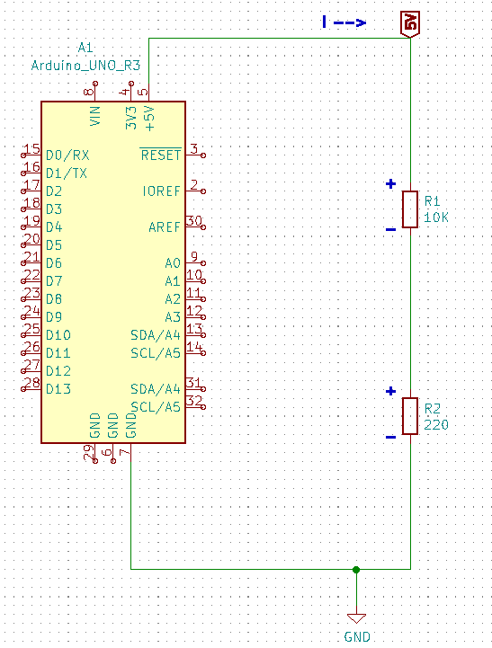
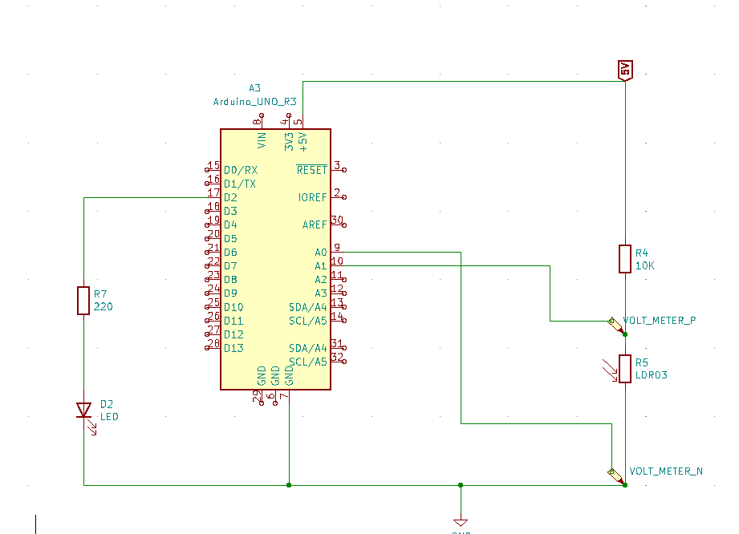

# Light Dependent Resistor (LDR)

*Description in work*
## Voltage Divider Circuit

A simple way to use an LDR is to measure the change in voltage across the LDR as the light changes.  To demonstrate how this is done, we will examine a simple voltage divider with fixed resistors.  We will then apply this concept to a variable resistor, in this case an LDR.

The image below is a simple voltage divider. The Arduino part can simply be considered a 5 Volt voltage source as those are the only terminals that the circuit is connected to.  If we wanted to, we could relace the Arduino with a 5V battery and the results would be the same.

### Current through the circuit
According to Ohm's law (V=I\*R), the total current is the voltage (5V) divided by the total resistance (10220R).  Recall that resistance adds in a series circuit (components conected one after another).  Note that you will often see **R** in place of the Greek Omega to indicate Ohms.

Substituting our values we have:

I = 5V/10220R
I = 4.89E-4 or 0.00049 Amps; This is 0.49 mA (milliamps) or 490 microamps.
I = 0.00049 Amps

### Voltage across each Resistor 

Looking again at Ohm's law (V=I\*R) we know that the voltage across a circuit element is the current multiplied by the resistance.
Since we know the current flowing through each resistor is the same (they are in series), and that current is 0.00048923A, we can now calculate the voltage across each resistor.

V(R1) = I\*R1
V(R1) = 0.00048923 A * 10000R = 4.8923V
**V(R1) = 4.8923V**

Likewise...

V(R2) = I\*R2
V(R1) = 0.00048923 A * 220 = 0.108V
**V(R2) = 0.108V**

Note that the sum of the two voltages add up to the total voltage across both reistors.  (Kirchoff's Voltge Law)

**V(R1) + V(R2) = 4.8923V + 0.108V = 5V**

### LDR Circuit

