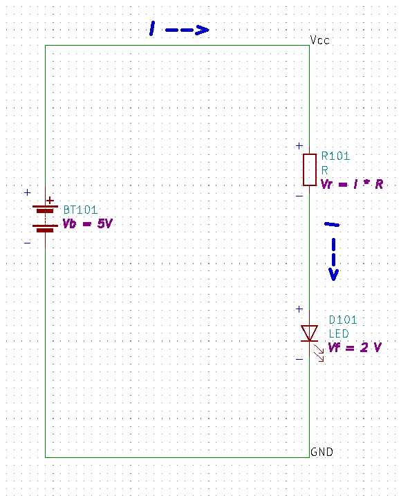

# LED Current limiting

LEDs (Light Emitting Diodes) are inexpensive (usually less than $0.10), small, reliable, and energy efficient.  However, unlike incandescent bulbs, they require that the current through them is limited.  If this is not done, they will quickly be destroyed.

The following sections describethis process. Only the first two sections are required todetermine the values of the resistor.

[LED Parameters](./LED%20Current%20Limiting.md#led-parameters)

[Basic Calculations](./LED%20Current%20Limiting.md#basic-calculation)

[Detailed Calculation](./LED%20Current%20Limiting.md#detailed-explanation-of-calculation)

[Power Dissipation](./LED%20Current%20Limiting.md#power-dissipation)

In order to do this, we need some basic information regarding the LED.  Below is a link to a spcification (spec) sheet for a common LED along with an image with the more useful parameters higlighted.  We will use these parameters to determine how to limit the current through the LED.  Ideally, you should use the spec sheet for the LED part that you are using, but LEDs in general have similar characteristics that are used to determine current limiting circuity.

[LED Spec Sheet](./COM-09590-YSL-R531R3D-D2.pdf)

### LED Parameters

* Forward Current (**If**) - This is the current that will result in device damage if the maximum is continuously exceeded.
* Peak Fwd current (**Ifp**)- This is the current that will result in device damage if the maximum exceeded for short periods.
* Suggested using current (**Isu**) - A manufacturer suggested current value to allow maximum brightness and still operate safely.  

Note that these parameters are in milliamps, or 1 mA == 0.001 Amps.

For this example, we will use the suggested value (16-18 mA), picking 16 mA to increase reliability but still have a reasonable brightness.

* Forward voltage - This is the voltage drop across the LED at the forward current listed

This voltage varies between individual LEDs, and a range is given in the spec.  It also vaies depending on the color of the LED. We will use 2.0 volts in this example.

### Basic Calculation

If you just want to know the value of the resistor, the formula **R = (Vcc - Vf) / Isu** is shown below. A more detailed explanation follows.

Vcc: Supply voltage 5 V

Vf: Forward Voltage Drop 2 V

Isu:  Suggested current 16 ma

**R = (Vcc - Vf) / Isu**

R = (5 - 2) / 0.016

R = 3 / .016 = 187.5 Ohms

If we consult a [table of industry standard resistor values](https://eepower.com/resistor-guide/resistor-standards-and-codes/resistor-values/), we find that 220 Ohms is the closest standard value for 10% tolerance resistors.  As tolerances get tighter the proce goes up, and this value is not critical, so we will us a 10% 220 Ohm resistor.  We increase the value over the theoretical 187.5 because this will reduce rather than increase the current, which could damage the LED, especially if the resistance variance due to tolerance lowers the value.

If we subsitute our 220 Ohm resistor into the baove equation

  R = (Vcc - Vf) / Isu

First solving for Isu  

  **Isu = (Vcc - Vf) / R **

Substituting our values gives
  
  Isu = 3 V / 220 Ohm  or an **Isu = 13.6 mA**

## Detailed Explanation of Calculation

Referencing the circuit diagram below, we will show in detail how to determine the value of the current limiting resistor. Note that we are using a 5V battery because most digital logic circuits (such as an Arduino) have an output voltage of 5 Volts.  Low power devices sometimes use 3.3 volts. When there is a logic HIGH level, this is equivalent to connecting a 5V (or 3.3V if low power) battery to the output.

First, some simple concepts/rules:

- The current **I** that flows through each element (Battery, Resistor, LED) is the same for each element since there are no branches in the circuit.  
- We may assume a current direction for analysis but it is best to assume that the current flows from the poitive termimal of the battery source to the negative.
- Voltage polarity (+/-) is assigned a '+' for the side that current enters, assign a '-' for the exiting terminal. 
- The voltage across a circuit element is the Current (I) multiplied by the Resistance (R), *Ohm's Law*. For voltage sources such as batteries, we use the voltage and polarity of the battery.
- When summing, use the sign (+/-) first reached on each element.
- The sum of the voltages around the circuit is zero (0) - *Kirchoff's Voltage Law (KVL)*

These rules are illustrated in the circuit below

### KVL Loop

First we sum the voltages using KVL, beginning at the lower left point in the circuit and continuing clockwise back to that point.  Remember that the total sum is zero (KVL), and we use the sign first found when entering each element.

As seen in the diagram, we have the following voltages:

* Vb: Battery Voltage
* Vr: Resistor Voltage 
* Vf: Diode Voltage

**-Vb + Vr + Vf = 0**  Note that Vb is negative since we entered through the '-'side of the battery. All other elements are positive since we entered throught the '+' side.

Now we can substitute for each element voltage as follows:

* **Vb** - Battery voltage **5V**
* **Vr** - Resistor voltage. By Ohm's law, the Resistor voltage is **I * R** where I is the current and R is the resistor value.
* **Vf** - LED voltage.  Unlike a resistor, LEDs (diodes) are complex, non-linear devices, a subject for another tutorial.  Luckily, the manufacturer provides the nominal voltage value (**2V**) at a current near the recommended value.

Substituting the values above into the KVL equation **-Vb + Vr + Vf = 0** we get:

**-5 + (I * R)  + 2 = 0**

Rearranging and solving for R:

**R = (5 - 2)/I**

Since we know that the current should be 16 mA or .016 A we can now solve for R

**R = 3/.016**

**R = 187.5 Ohms**

As in the first section, we decide to use a 220 Ohm resistor which will result in a current **I** of 13.6 mA.  There is one last parameter we need to determine, and that is the power rating of the resistor.

## Power Dissipation

Any time there is a current flowing through a device and there is a voltage across that device, power is dissipated from that device.  In the case of resistors, this energy is released in the form of heat.  Resistors and many other components are given a maximum power rating that they can withstand.  The power dissipated (**P**), measured in Watts (**W**), in a device can be calculated by the following equations:

* **P = I^2 * R ** or I*I*R where **I** is the currnet 
* **P = V^2/R** Where **V** is the voltage across the resistor
* **P = I * V 

Since we know the resitor value is 220 Ohms, and the current is 13.6 mA we will use the first equation **P = I^2 * R **

P = 0.0136 * .0136 * 220
**P = .041 W** or 41 mW (milliwatts)

41 mW is very small and you would have trouble finding a resistor so small that it could not dissipate this power, but it is always good to check. 
As an example, suppose we had a 200 mA current running through a 220 ohm resistor, we could then calculatethe power as:

P = 0.200 * 0.200 * 220 or 
**P = 8.8 W !!** 
A small 1/8 W resistor would quickly burn up with smoke and potential flames.

Note: The above example would require a power source (Large battery or Lab Power Supply) that could supply 44 Volts at 200 mA.

